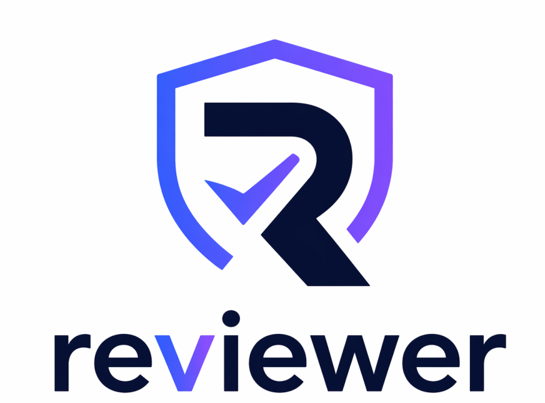
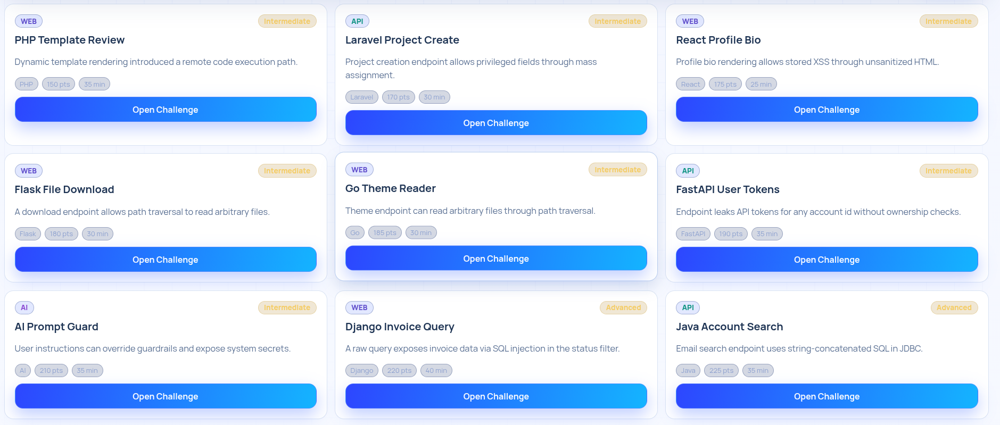
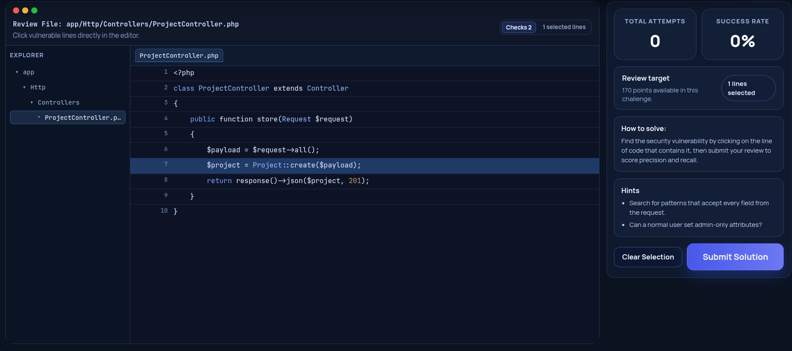
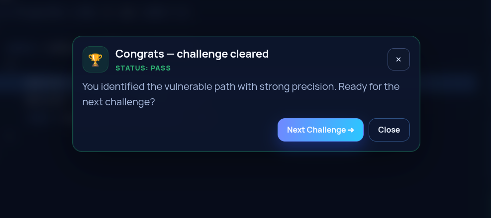

<div align="center">
  

# Reviewer

**An open-source secure code review training platform for web, API, AI, and MCP security.**

Practice identifying vulnerable lines, explaining impact, and choosing safer remediations in realistic code-review challenges.

[](LICENSE)
[](https://fastapi.tiangolo.com/)
[](https://react.dev/)
[](https://owasp.org/)

</div>

> [!IMPORTANT]
> Reviewer intentionally contains **vulnerable code samples for education**. The snippets are simulated examples and must not be copied into production systems.

## Why Reviewer?

Security guidance becomes useful when developers can apply it during code review. Reviewer provides a hands-on workspace where learners can:

- inspect realistic vulnerable snippets across multiple languages and frameworks;
- select the lines responsible for a vulnerability;
- receive immediate remediation guidance and OWASP mappings;
- explore API Security Top 10 and LLM/AI security scenarios;
- track progress, scores, and team learning activity;
- use a demo mode without creating an account.

## Screenshots

### Challenge catalogue



### Secure review workspace



### Feedback and completion



More screenshots are available in [`docs/screenshots`](docs/screenshots).

## Training Coverage

- **Web security:** injection, XSS, path traversal, command execution, and unsafe deserialization
- **API security:** BOLA/BFLA, broken authentication, SSRF, mass assignment, and resource abuse
- **AI security:** prompt injection, model denial of service, insecure output handling, and data poisoning
- **Agent and MCP security:** excessive agency, unsafe tool routing, and filesystem access
- **Languages and frameworks:** Python, PHP, JavaScript, TypeScript, Java, Go, React, Django, Flask, FastAPI, Laravel, Spring Boot, and Next.js

## Architecture

```text
Browser (React + Vite)
          |
          v
/api/v1 gateway (FastAPI)
  |-- /health
  |-- /auth
  |-- /demo
  |-- /training
  `-- /admin
          |
          v
SQLAlchemy + SQLite (development default)
```

Security controls include HttpOnly session cookies, CSRF protection for authenticated writes, Argon2 password hashing, JWT issuer/audience validation, configurable RS256 signing, security headers, constrained payloads, and role-based admin routes.

## Quick Start

### Prerequisites

- Python 3.11+
- Node.js 20+
- npm 10+

### 1. Start the API

```bash
git clone https://github.com/msabenda/reviewer.git
cd reviewer/backend
python3 -m venv .venv
source .venv/bin/activate
pip install -r requirements.txt
cp .env.example .env
uvicorn app.main:app --reload --port 8000
```

The development database is created automatically at `backend/reviewer.db` and is ignored by Git.

### 2. Start the web app

In another terminal:

```bash
cd reviewer/frontend
npm ci
npm run dev
```

Open <http://localhost:5173>. The frontend uses `http://localhost:8000/api/v1` by default.

## Configuration

Create `backend/.env` when you need to override development defaults:

```dotenv
ENVIRONMENT=development
SECRET_KEY=replace-with-a-long-random-development-secret
DATABASE_URL=sqlite:///./reviewer.db
ALLOWED_ORIGINS=http://localhost:5173,http://127.0.0.1:5173
JWT_ISSUER=reviewer-api
JWT_AUDIENCE=reviewer-clients
```

Production deployments must use a strong secret-management system and RSA signing keys:

```dotenv
JWT_RSA_PRIVATE_KEY_PATH=/run/secrets/jwt-private.pem
JWT_RSA_PUBLIC_KEY_PATH=/run/secrets/jwt-public.pem
```

Never commit `.env` files, databases, private keys, access tokens, or real learner data.

## API Overview

| Scope | Routes |
| --- | --- |
| Health | `GET /api/v1/health` |
| Demo | metadata, filters, challenges, statistics, and submissions under `/api/v1/demo` |
| Authentication | register, login, current user under `/api/v1/auth` |
| Training | challenges, submissions, progress, squad pulse, and leaderboard under `/api/v1/training` |
| Administration | challenge upload and role management under `/api/v1/admin` |

Interactive OpenAPI documentation is available at <http://localhost:8000/docs> in development and disabled outside development.

## Project Structure

```text
backend/
  app/api/v1/       Versioned API routes
  app/core/         Configuration, database, auth, and schema migration
  app/middleware/   Request logging and security headers
  app/models/       SQLAlchemy models
  app/services/     Authentication and challenge logic
  app/data.py       Built-in educational challenge catalogue
frontend/
  src/components/   Reusable training interface components
  src/context/      Authentication state
  src/pages/        Demo, learning, progress, leaderboard, and admin pages
  src/services/     API client
docs/
  screenshots/      Product screenshots
  PRODUCT_ROADMAP.md
scripts/            Training-content generation utilities
```

## Validation

```bash
# Backend tests
python -m pip install -r backend/requirements-dev.txt
PYTHONPATH=backend DATABASE_URL=sqlite:////tmp/reviewer-test.db pytest -q backend/tests

# Frontend production build
cd frontend
npm ci
npm run build
```

## Responsible Use

Reviewer is designed for defensive education in controlled environments. Do not use its examples to access systems without explicit authorization. See [`SECURITY.md`](SECURITY.md) for vulnerability reporting and scope.

## Contributing

Bug fixes, new defensive challenges, accessibility improvements, documentation, and tests are welcome. Read [`CONTRIBUTING.md`](CONTRIBUTING.md) before opening a pull request.

## Roadmap

Planned GitHub integration, challenge packs, assessment workflows, and AI-assisted review guardrails are documented in [`docs/PRODUCT_ROADMAP.md`](docs/PRODUCT_ROADMAP.md).

## License

Released under the [MIT License](LICENSE). Copyright © 2026 Msambili Ndaga.
